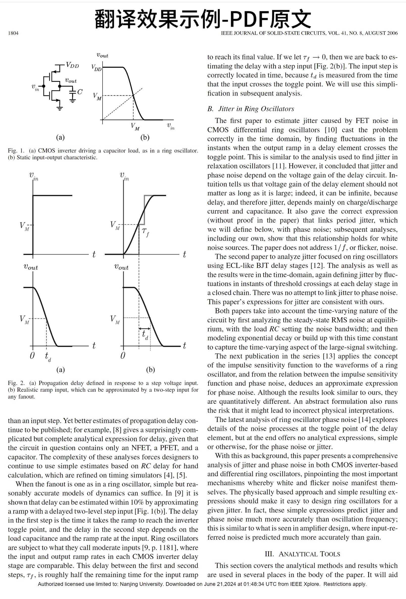
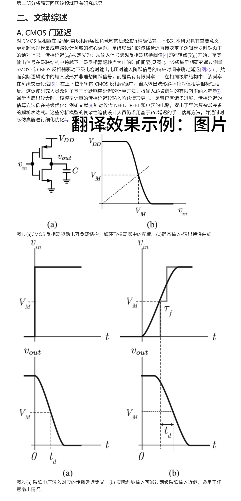
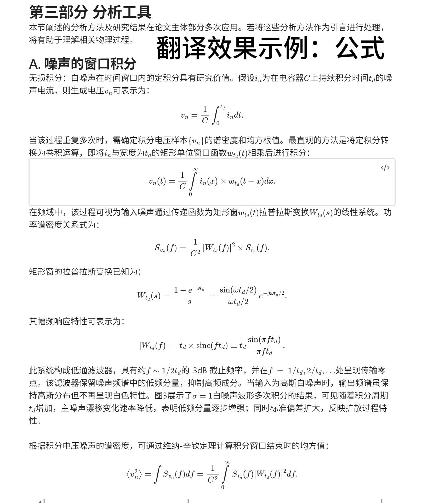

# PDF文献翻译助手

这是一个基于 [MinerU](https://github.com/opendatalab/MinerU) 开发的文献翻译工具，可以将英文PDF文献转换为中文Markdown格式，帮助研究人员更高效地阅读和理解英文文献。

## 功能特色

- **📄 智能文档解析** - 基于MinerU技术，精准识别PDF文档结构，保持原文排版格式
- **🔤 高精度提取** - 准确提取文本内容，完美支持数学公式和特殊字符
- **📊 复杂元素识别** - 精准处理表格、图片、公式等复杂元素
- **🌐 专业翻译** - 基于DeepSeek API的高质量中文翻译，保持学术术语准确性
- **📝 Markdown输出** - 标准Markdown格式输出，完美适配Obsidian等笔记软件
- **🎯 批量处理** - 支持同时处理多个PDF文件
- **💻 现代化界面** - 基于Next.js的美观Web界面
- **🔌 分离式架构** - 前后端分离，支持分布式部署

## 效果示例
---

---

---

---

## 环境要求

- 操作系统：Windows 10/11、Linux、macOS
- Python 3.10 或更高版本
- Node.js 18.0 或更高版本
- npm 或 pnpm 包管理器
- DeepSeek API Key（用于翻译服务）

## 安装步骤

### 1. 安装基础环境

1. 安装 Python 环境
   ```bash
   # 安装 Miniconda（推荐）
   wget https://repo.anaconda.com/miniconda/Miniconda3-latest-Windows-x86_64.exe
   # 或访问 https://docs.conda.io/projects/miniconda/en/latest/ 下载安装
   
   # 创建虚拟环境
   conda create -n translate python=3.10
   conda activate translate
   ```

2. 安装 Node.js 环境
   - 访问 [Node.js官网](https://nodejs.org/) 下载并安装 LTS 版本
   - 验证安装：`node --version` 和 `npm --version`

### 2. 安装项目

1. 安装 MinerU
   - 按照 [MinerU官方文档](https://github.com/opendatalab/MinerU) 完成安装
   - 确保模型文件下载完成

2. 克隆项目
   ```bash
   git clone [项目地址]
   cd translate
   ```

3. 安装依赖
   ```bash
   # 安装后端依赖
   cd server
   pip install -r requirements.txt
   
   # 安装前端依赖
   cd ../front
   npm install   # 或使用 pnpm install
   ```

### 3. 配置环境变量

1. 获取 DeepSeek API Key
   - 访问 [DeepSeek官网](https://platform.deepseek.com/) 注册账号
   - 在控制台创建 API Key

2. 设置环境变量
   
    `.env` 文件：
   ```
   DEEPSEEK_API_KEY=your_api_key_here
   ```


## 运行说明

### Windows系统

1. 配置启动文件
   - 打开 `start.bat` 文件
   - 修改 Python 环境路径为你的实际路径，例如：
     ```batch
     # 修改这一行中的Python路径
     start "Flask Backend" cmd /k "cd server && "D:\myenvs\translate\python.exe" app.py"
     ```
   - 路径通常在 Anaconda 安装目录下的 `envs\translate\python.exe`

2. 直接运行（推荐）
   - 双击运行 `start.bat`
   - 等待前端和后端服务启动完成

2. 手动运行
   ```bash
   # 终端1：启动前端
   cd front
   npm run start   # 或 pnpm start
   
   # 终端2：启动后端
   cd server
   python app.py
   ```

### Linux/macOS系统

1. 创建启动脚本
   ```bash
   # 创建并设置权限
   touch start.sh
   chmod +x start.sh
   ```

2. 编辑 start.sh
   ```bash
   #!/bin/bash
   # 启动前端
   cd front && npm run start &
   # 启动后端
   cd server && python app.py
   ```

3. 运行服务
   ```bash
   ./start.sh
   ```

## 访问应用

- 前端界面：http://localhost:3000

## 使用说明

1. 打开浏览器访问 http://localhost:3000
2. 注册/登录账号
3. 在翻译页面：
   - 点击"选择文件"上传PDF文件
   - 或拖拽文件到上传区域
4. 等待处理完成，下载翻译结果

## 注意事项

- 首次运行时会自动下载模型文件，请确保网络连接正常
- 建议使用较新版本的浏览器（Chrome、Firefox、Edge等）
- 大型PDF文件处理可能需要较长时间，请耐心等待
- 确保端口3000和5000未被其他程序占用
- 请妥善保管 DeepSeek API Key，不要将其提交到代码仓库

## 额外说明
如果要部署到有公网ip的服务器上，需要同时将前后端的http://localhost地址改成公网服务器地址

## 技术支持

如有问题或建议，请通过以下方式联系我们：
- 在 GitHub 提交 Issue
- 发送邮件至：799174142@qq.com

## 许可证

本项目采用 [MIT License](LICENSE) 开源协议 
