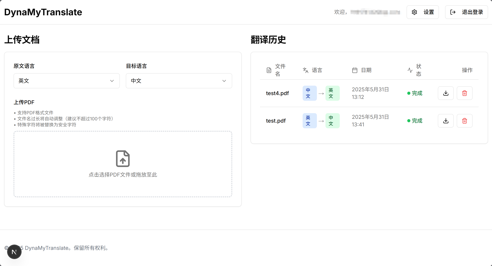

# DynaMyTranslate - 智能PDF文献翻译助手

这是一个基于 [MinerU](https://github.com/opendatalab/MinerU) 开发的智能文献翻译工具，支持多语言PDF文档翻译，具备智能配置和多设备访问能力。

## ✨ 功能特色

- **📄 智能文档解析** - 基于MinerU技术，精准识别PDF文档结构，保持原文排版格式
- **🔤 高精度提取** - 准确提取文本内容，完美支持数学公式和特殊字符
- **📊 复杂元素识别** - 精准处理表格、图片、公式等复杂元素
- **🌍 多语言翻译** - 支持中英日韩法德西俄8种语言互译，不再局限于英中翻译
- **🎯 精准翻译** - 基于DeepSeek API的高质量翻译，保持学术术语准确性
- **📝 Markdown输出** - 标准Markdown格式输出，完美适配Obsidian等笔记软件
- **🔧 智能标题修复** - 自动修复翻译后的Markdown标题层级结构，确保文档层次清晰
- **👤 用户系统** - 支持用户注册、登录和个人配置管理
- **📊 翻译历史** - 完整的翻译记录管理，支持下载和删除
- **🌐 智能配置** - 自动检测访问地址，支持本机和Tailscale网络访问
- **💻 现代化界面** - 基于Next.js的美观响应式Web界面
- **🔌 分离式架构** - 前后端分离，支持灵活部署
- **🔑 个人API配置** - 支持用户自定义API Key，安全便捷

## 🏗️ 技术架构


## 🌍 支持的语言
| 语言 | 代码 | 语言 | 代码 |
|------|------|------|------|
| 🇨🇳 中文 | zh-CN | 🇫🇷 法文 | fr |
| 🇺🇸 英文 | en | 🇩🇪 德文 | de |
| 🇯🇵 日文 | ja | 🇪🇸 西班牙文 | es |
| 🇰🇷 韩文 | ko | 🇷🇺 俄文 | ru |

## 效果示例
### 公式


---
### 图片


---
### 网站



## 🚀 快速开始
### 1. 环境准备

#### Python环境
```bash
# 安装 Miniconda（推荐）
# 访问 https://docs.conda.io/projects/miniconda/en/latest/ 下载安装

# 创建虚拟环境
conda create -n translate python=3.10
conda activate translate
```

#### Node.js环境
- 访问 [Node.js官网](https://nodejs.org/) 下载并安装 LTS 版本
- 验证安装：`node --version` 和 `npm --version`

### 2. 安装项目

#### 安装MinerU
```bash
# 按照 MinerU官方文档完成安装
# https://github.com/opendatalab/MinerU
```

#### 克隆和安装
```bash
# 克隆项目
git clone [项目地址]
cd DynaMyTranslate-main

# 安装后端依赖
pip install -r requirements.txt

# 安装前端依赖
cd front
npm install 或者pnpm install
cd ..
```

### 3. 配置访问地址

项目已内置智能配置，支持多种访问方式：

```json
{
  "backend_host": "0.0.0.0",
  "backend_port": 5000,
  "frontend_port": 3000,
  "tailscale_ip": "100.88.126.48"
}
```

**支持的访问地址：**
- 🏠 本机访问：`http://localhost:3000`
- 🌐 Tailscale访问：`http://100.88.126.48:3000`(替换为服务器的公网ip)
- 📱 其他设备：通过Tailscale IP访问

### 4. 启动服务

#### Windows系统
```bash
# 修改 start.bat 中的Python路径后直接运行
start.bat
```

#### Linux/macOS系统
```bash
# 终端1：启动后端
cd server
python app.py

# 终端2：启动前端
cd front
npm run build && npm run start -- -H 0.0.0.0 -p 3000
```

### 5. 访问应用

- **本机访问**: http://localhost:3000
- **远程访问**: http://100.88.126.48:3000（替换为您的实际IP）

## 📖 使用指南

### 首次使用
1. 🌐 访问网站并注册账户
2. ⚙️ 点击右上角"设置"配置DeepSeek API Key
3. 🌍 选择源语言和目标语言
4. 📄 上传PDF文件开始翻译

### API Key获取
- 访问 [DeepSeek平台](https://platform.deepseek.com/) 注册并获取API Key
- 在网站设置页面输入API Key即可使用

### 翻译流程
1. **选择语言** - 设置源语言和目标语言
2. **上传文件** - 支持拖拽上传PDF文档
3. **实时进度** - 查看转换、翻译、修复等阶段进度
4. **下载结果** - 获取包含原文和译文的ZIP文件

## 🔧 智能特性

### 自动地址检测
- 前端智能检测当前访问地址
- 自动选择对应的后端API地址
- 无需手动配置，支持多环境访问

### 多语言支持
- 动态语言选择和用户偏好保存
- 智能翻译提示优化
- 支持8种主流语言互译

### 文档处理
- 保持原文格式和结构
- 智能处理图片、表格、公式
- 自动修复Markdown标题层级

## 📁 项目结构

```
DynaMyTranslate-main/
├── config.json              # 智能配置文件
├── start.bat                # Windows启动脚本
├── front/                   # 前端项目
│   ├── app/                 # Next.js页面
│   ├── components/          # React组件
│   ├── lib/                 # 工具库
│   └── contexts/            # 上下文
├── server/                  # 后端项目
│   ├── app.py              # Flask主应用
│   ├── translate.py        # 翻译引擎
│   ├── uploads/            # 上传文件
│   └── processed_files/    # 处理结果
└── example/                # 示例文件
```

## 🛠️ 配置选项

### config.json参数说明

| 参数 | 说明 | 默认值 |
|------|------|--------|
| `backend_host` | 后端绑定地址 | `"0.0.0.0"` |
| `backend_port` | 后端端口 | `5000` |
| `frontend_port` | 前端端口 | `3000` |
| `tailscale_ip` | Tailscale/远程IP | `"100.88.126.48"` |

### 部署配置
- **本地开发**: 保持默认配置
- **远程访问**: 修改`tailscale_ip`为您的实际IP
- **端口冲突**: 修改端口号并重启服务


## ⚠️ 注意事项

- **首次运行**: 会自动下载MinerU模型文件，需要稳定网络
- **浏览器兼容**: 建议使用Chrome、Firefox、Edge等现代浏览器
- **文件大小**: 大型PDF处理时间较长，请耐心等待
- **端口占用**: 确保3000和5000端口未被占用
- **API额度**: 注意DeepSeek API的使用额度和费用

## 🚀 部署说明

### 服务器部署
1. 修改`config.json`中的IP地址
2. 确保防火墙开放3000和5000端口
3. 后端自动支持CORS多地址访问
4. 前端智能检测API地址

### 网络配置
- **Tailscale**: 自动支持Tailscale网络访问
- **局域网**: 其他设备可通过IP地址访问
- **公网**: 配置反向代理支持HTTPS访问

## 🤝 技术支持

如有问题或建议：
- 📧 邮件：799174142@qq.com
- 🐛 GitHub Issues: 提交问题和功能请求
- 📖 Wiki: 查看详细文档和FAQ

## 📄 许可证

本项目采用 [MIT License](LICENSE) 开源协议

---

**DynaMyTranslate** - 让多语言文献翻译变得简单智能！🚀
